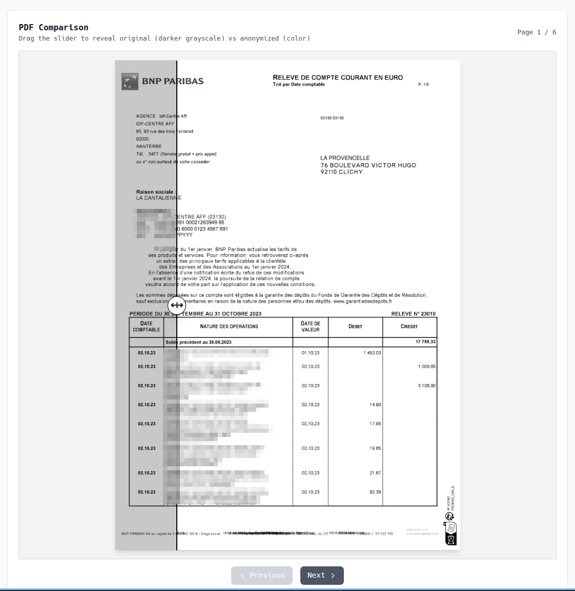
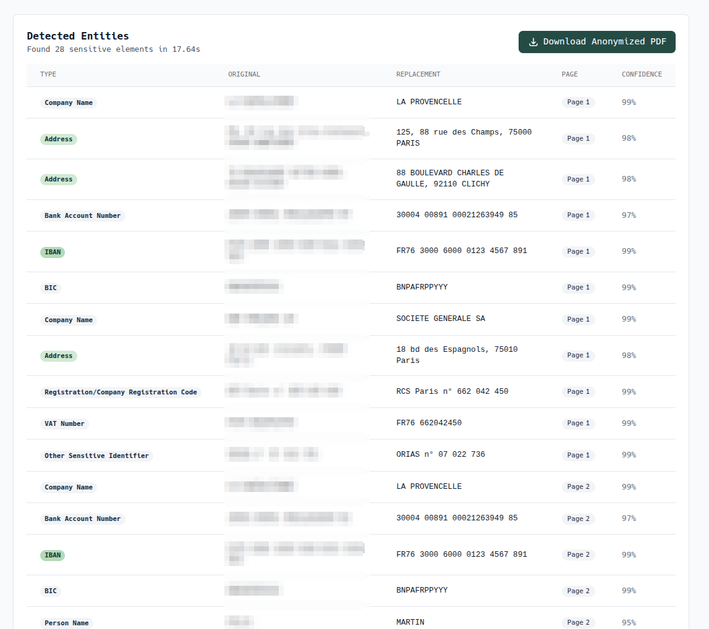

# 🎭 pdf-holomask

**Auto-anonymize PDFs with synthetic data. Same layout, zero leaks.**

pdf-holomask is a tool that automatically detects and replaces sensitive information in PDFs, turning real-world data into synthetic lookalikes that preserve structure, readability, and realism.

Built by [Holofin.ai](https://holofin.ai), it's a privacy-preserving engine for teams who need to share or process documents safely without destroying their content.

---

## What it does

- **Detects PII and sensitive entities** — names, emails, phone numbers, IBANs, company data, and more
- **Replaces, not redacts** — swaps each detected element with realistic synthetic text (same format, length, and style)
- **Keeps layout intact** — no black boxes, no broken text flow, no loss of visual fidelity
- **Export & review** — instantly download the anonymized PDF or review detected entities in a clean UI

---

## What it does NOT

- **Change images or scans** — embedded images and scanned content remain untouched
- **Work on image-based PDFs** — requires extractable text (not OCR-only documents)
- **Guarantee 100% accuracy** — AI-powered detection may miss edge cases or unusual formats
- **Replace your legal compliance** — this is a tool, not a certified anonymization solution

---

## ⚡ Quick Start

### Prerequisites

- Python 3.11+
- [uv](https://github.com/astral-sh/uv) (recommended) or pip
- Mistral API key ([get one here](https://console.mistral.ai/))

### Installation

```bash
# Clone the repository
git clone https://github.com/holofin-ai/pdf-holomask.git
cd pdf-holomask

# Copy environment template and add your API key
cp .env.example .env
# Edit .env and add your MISTRAL_API_KEY

# Install dependencies (including dev tools)
make install

# Run the server
make run

# Open http://localhost:8000 in your browser
```

---

## 🎯 Usage

1. **Upload a PDF** — drag and drop or select a file (max 50MB)
2. **Click "Process PDF"** — the tool analyzes and anonymizes in one step
3. **Review changes** — see original and anonymized PDFs side-by-side
4. **Check entities** — view all detected sensitive information in a table below
5. **Download** — save the anonymized PDF with preserved metadata

### Example: Bank Statement Anonymization

**Side-by-side comparison** (drag slider to reveal original vs anonymized):



**Detected entities** with synthetic replacements:



The tool automatically detects and replaces:
- 🏦 Bank account numbers and IBANs
- 🏢 Company names and addresses
- 👤 Personal names
- 📋 Registration codes and VAT numbers
- And more...

---

## 🔧 How It Works

### Architecture

**Backend:**
- **FastAPI** handles file uploads and orchestrates processing
- **pdfplumber** extracts text with page-aware positioning
- **Mistral AI** (`mistral-medium-latest`) detects entities and generates synthetic replacements
- **PyMuPDF (fitz)** anonymizes PDFs by redacting originals and rewriting replacements with matched fonts

**Frontend:**
- **Alpine.js** manages reactive state (file upload, processing, results)
- **Tailwind CSS** provides clean, responsive styling
- **PDF.js** renders original and anonymized PDFs in canvas elements

### Processing Flow

```
Upload PDF → Extract text → Mistral AI analysis → Anonymize with PyMuPDF → Return results
```

### Complete Data Removal

The anonymization process uses PyMuPDF's full garbage collection to ensure original text cannot be recovered:

```python
# Remove all deleted objects and sanitize PDF structure
doc.save(output_path, garbage=4, clean=True, deflate=True)
```

This means:
- **`garbage=4`**: Full garbage collection removes all unused/deleted objects
- **`clean=True`**: Sanitizes the PDF structure
- Original text is **permanently deleted** and cannot be recovered even with forensic tools

---

## 🌐 Ideal For

- Sharing financial or legal documents internally or with partners
- Preparing PDFs for machine learning or NLP model training
- Demonstrating document pipelines without exposing real data
- Testing systems with realistic but synthetic document data

---

## ✨ Philosophy

Like a **Holocron guarding ancient knowledge**, pdf-holomask protects data by transforming it, preserving meaning without revealing truth.


---

## 🛡️ Privacy & Security

- **Local processing:** All PDF manipulation happens on your machine
- **No persistence:** Files are deleted immediately after processing (no database, no storage)
- **Permanent redaction:** Original text is fully removed with garbage collection (cannot be recovered with forensic tools)
- **Metadata preserved:** Original PDF metadata is kept, with author field updated to "holomask https://holofin.ai"
- **Open source:** Fully auditable, MIT licensed

---

## 🎨 Customization

### Entity Detection Configuration

You can easily customize which types of sensitive information to detect by editing `entity_config.yaml`:

```yaml
entities:
  - type: "Company Name"
    description: "Company and organization names"
    example: "Acme Corporation S.A."
    enabled: true
```

**Default entity types include:**
- Registration/Company codes
- VAT numbers, IBANs, bank accounts
- Person names, emails, phone numbers
- **Company names** (explicitly included!)
- Addresses
- Social security numbers
- Credit card numbers
- And more...

**To add custom entity types:**
1. Edit `entity_config.yaml`
2. Add your entity with type, description, and example
3. Set `enabled: true`
4. Restart the application

No code changes needed! See [ENTITY_DETECTION.md](ENTITY_DETECTION.md) for detailed documentation.

---

## 🤝 Contributing

Contributions are welcome! Please feel free to submit issues or pull requests.

### Adding New Entity Types

Want to detect industry-specific data (medical records, legal citations, etc.)? Just edit `entity_config.yaml`! See [ENTITY_DETECTION.md](ENTITY_DETECTION.md) for a complete guide.

### Development

```bash
# Run development server
make run

# Run linter
make lint

# Format code
make format

# Run tests with coverage
make test

# Clean temporary files
make clean
```

See `make help` for all available commands.

---

## ⚖️ License

**MIT License** — Open source, privacy shouldn't cost transparency.

See [LICENSE](LICENSE) for details.
